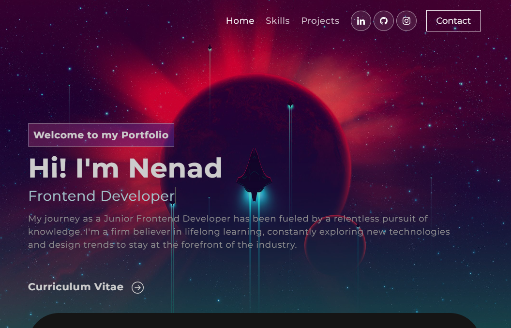

# Portfolio Website

This is my personal portfolio website showcasing my skills, projects, and experience. The website is built using React with Typescript, Bootstrap, and custom CSS.

## Table of Contents

- [Demo](#demo)
- [Features](#features)
- [Technologies Used](#technologies-used)
- [Getting Started](#getting-started)
- [Usage](#usage)
- [Customization](#customization)
- [Contributing](#contributing)
- [License](#license)

## Demo

https://shkurtevski.dev/

## Features

- **Responsive Design:** The portfolio is designed to be fully responsive, ensuring a seamless experience across different devices.
- **Project Showcase:** Highlight your projects with details like project descriptions, technologies used, and links to live demos or repositories.
- **Skills Section:** Clearly display your skills and proficiency levels using visual elements.
- **Contact Form:** Allow visitors to get in touch with you through a contact form.

## Technologies Used

- **React:** A JavaScript library for building user interfaces.
- **Typescript:** A superset of JavaScript that adds static types to the language.
- **Bootstrap:** A popular CSS framework for building responsive and mobile-first websites.
- **CSS:** Custom styling to enhance the visual appeal and customization of the website.

## Getting Started

### Prerequisites

- Node.js and npm installed on your machine.

### Installation

1. Clone the repository:

git clone https://github.com/Shkurtevski/MyPortfolio/tree/master

2. Navigate to the project directory:

cd your-portfolio

3. Install dependencies:

npm install

## Usage

1. Start the development server:

npm start

2. Open your browser and visit http://localhost:3000 to view your portfolio.

## Customization

- Modify the src/data/projects.ts file to update project details.
- Customize the src/styles directory for additional styling changes.
- Update the content in the src/components directory to reflect your personal information.

## Contributing

Contributions are welcome! If you find any issues or have suggestions for improvements, feel free to submit a pull request.